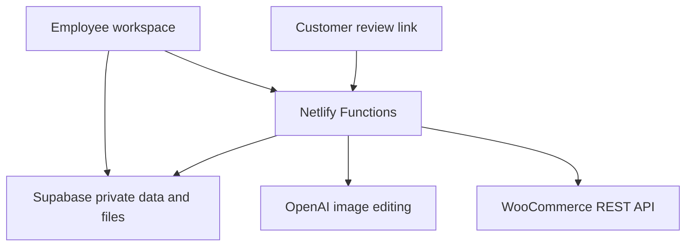

# Mockup Studio — Application Design

## Outcome

Mockup Studio adds a product-imaging pipeline to the existing Skilled Crafting application. An employee can collect blank product photographs and artwork, set decoration placement, create exact composites or AI-assisted lifestyle-quality renders, add store captions, obtain approval, calculate pricing, publish to WooCommerce, and generate a production packet without moving project data among unrelated tools.

## Workflow phases

| Phase | Employee action | System output |
|---|---|---|
| 1. Project | Name the project and optionally link a customer/campaign | Reusable project record and status |
| 2. Blank products | Upload tee, hoodie, hat, drinkware, or other blank photos; optionally link catalog URLs | Private source assets with product view and color metadata |
| 3. Artwork | Upload logos/graphics or import artwork-vault candidates | Private artwork assets, production notes, and fidelity setting |
| 4. Placement | Choose product/artwork, placement preset, size, position, rotation, and decoration method | Repeatable placement specification in percentages and inches |
| 5. Generate | Render an exact browser composite or request AI-assisted surface blending | One or more private mockup outputs |
| 6. Caption | Enter an identification name and choose font, size, text color, background, alignment, and padding | Clean mockup plus optional captioned store-card image |
| 7. Approval | Select outputs, mark internal status, or issue an expiring customer link | Auditable approval/change-request records |
| 8. Price | Add blank, decoration, labor, packaging, overhead, and other costs | Suggested retail price and margin calculation |
| 9. WooCommerce | Choose draft/publish, product text, images, categories, tags, price, colors, and sizes | New or updated WooCommerce product and optional variations |
| 10. Production | Confirm product/artwork/output readiness and print or download placement details | Production packet, CSV, and JSON handoff |

## Architecture

The browser performs authenticated project editing and exact pixel compositing. Long-running AI rendering is delegated to a Netlify Background Function. Public customer reviews never receive database credentials: a server function hashes and validates the expiring review token, creates short-lived signed image URLs, and records the response using the Supabase service role. WooCommerce credentials and the OpenAI key remain server-side.

## Security model

- All three mockup storage buckets are private.
- Anonymous database privileges are revoked from all Mockup Studio tables and RPCs.
- Authenticated employees have application-level access under the existing authentication gate.
- OpenAI generation permits admin, manager, and operator roles.
- WooCommerce publication permits admin and manager roles.
- Customer links store only a SHA-256 token hash and can expire or be revoked.
- Remote source downloads are HTTPS-only and restricted by `SC_MOCKUP_ALLOWED_ASSET_HOSTS`.
- The Supabase service-role key, OpenAI key, and WooCommerce secrets are used only by Netlify Functions.

## Exact versus AI-assisted output

The exact compositor is the recommended path for artwork containing precise lettering, legal marks, QR codes, or brand colors. It places the supplied pixels without asking a model to redraw them. AI Assist is optional and improves surface perspective, folds, highlights, texture, and shadows. AI can still introduce visual variation, so every AI output must be reviewed before publication or production.

AI Assist accepts raster PNG, JPEG, or WebP source files. SVG and PDF files may remain attached for production, but a raster derivative is required for generation.

## Data isolation

The migration adds only `mockup_*` tables, `sc_mockup_*` functions/policies, and three `sc-mockup-*` buckets. It does not alter inventory quantities, reservations, pull sheets, purchase orders, existing WooCommerce mappings, or Google Calendar records.

## Additional streamlining included

- Reuse blank products from the catalog and artwork from the existing artwork vault.
- Copy one placement specification to all product views.
- Preflight warnings for missing or unsuitable assets.
- Multiple AI variants with an exact-composite fallback.
- Captioned and clean output variants.
- Expiring customer approval links and revision notes.
- Cost/margin calculator before WooCommerce export.
- Draft-first WooCommerce publishing and optional variations.
- Printable production packet plus machine-readable CSV/JSON.
- Deployment Health checks for the OpenAI key and storage buckets.

